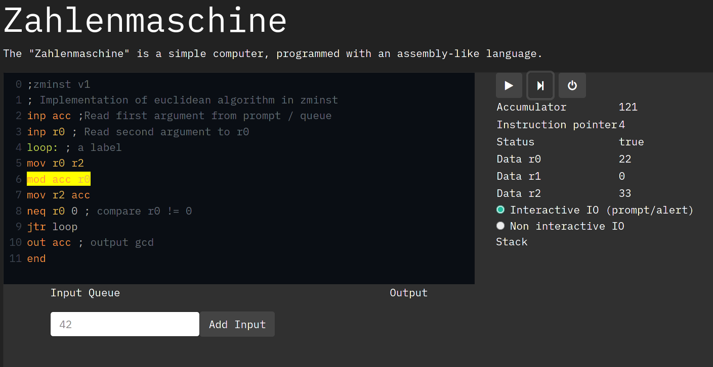

# Zahlenmaschine



[Try it!](https://frcroth.de/zahlenmaschine/)

## User documentation

The documentation for usage can be found [here](doc/general.md), possible operations are listed [here](doc/operations.md).

## Deployment

All Javascript is client side, so you can simply clone the repository and open index.html in the browser. You can not open doc.html however, since it tries to fetch files locally, which is disabled by most browsers. To view these you need to start a local server, for example with:

```python -m http.server```

You can find a deployed version [here](https://frcroth.de/zahlenmaschine/).
